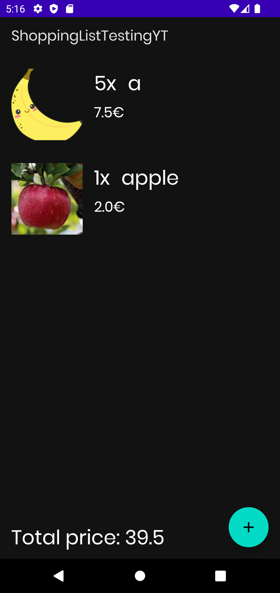
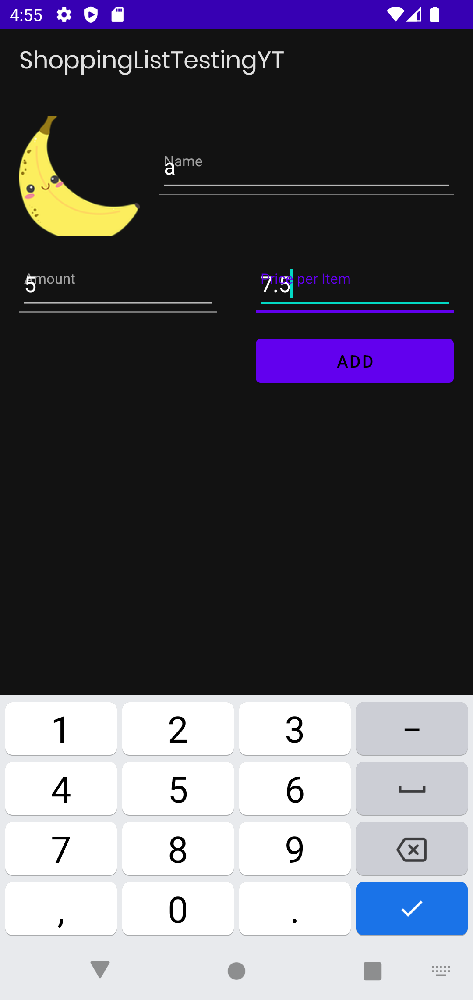
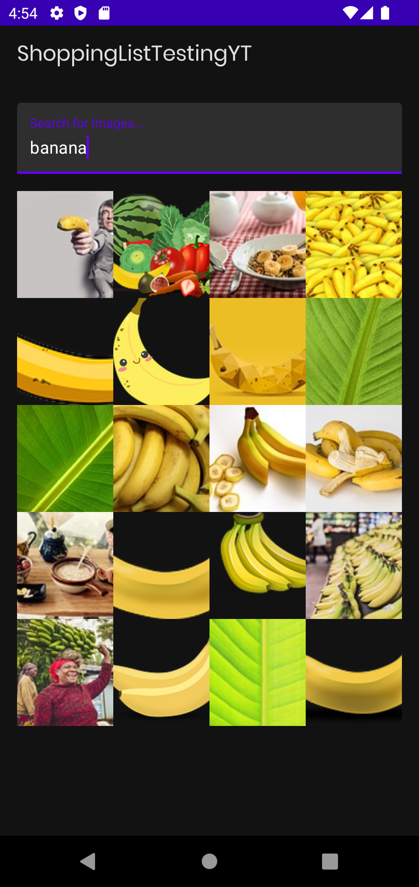

ShoppingListTesting
===========

An application that shows a mutable list of shopping items.

A solid app with relevant concepts: 
* Unit test
* Android test
* Inject test dependencies with Hilt
* Implement FragmentFactory & FakeRepository for testing
* Testing: Room database, ViewModel, Fragment
* Testing Navigation & UI with Mockito & Espresso

Getting Started
---------------

ShoppingListTesting uses the Pixabay API to load images by query for adding shopping items. To use the API, you will need to obtain a API key. See the
[Pixabay API](https://pixabay.com/) for instructions.

Screenshots
-----------

